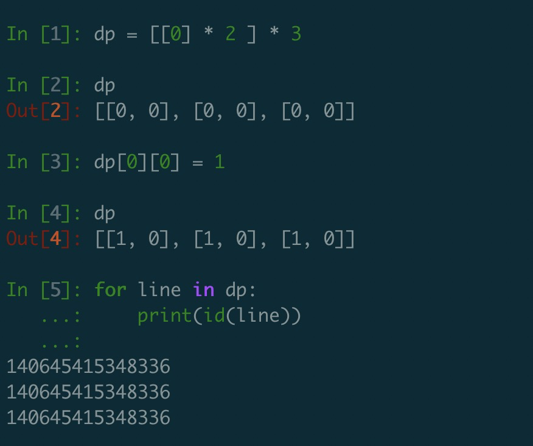
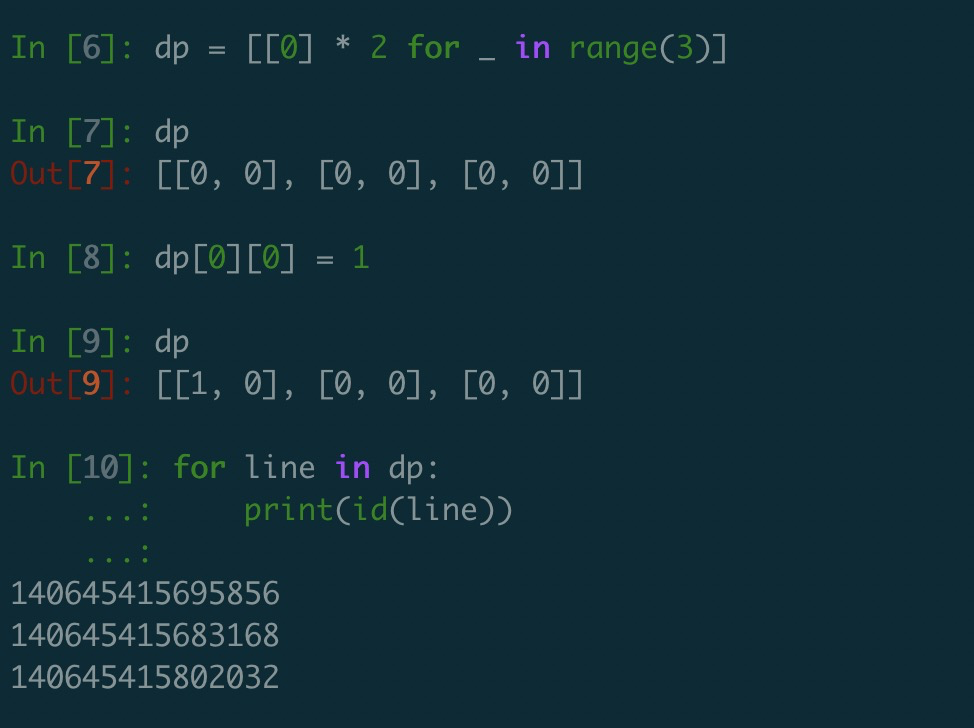

# 字符与数字

## 字符

### 字符取ascii码

```python
# 小写
ascii = ord(char)
```

### ascii码转字符

```python
char = chr(ascii)
```

### 判断某个字符是否是数字

```python
c.isdigit()
s[i].isdigit()
```


## 数字

### 获取最大值、最小值

```python
# 整数最大值
import sys

sys.maxint
```

### 进制转换

```python
# 字符串转二进制整数

x = int(a, 2)  # a是字符串，2为二进制
y = int('13', 8)  # a是字符串，8为八进制
z = int('0xa', 16) # 转十六进制

```

### 二进制数

`bin()` 返回一个整数 int 或者长整数 long int 的二进制表示

```python
x = 11
s = bin(x) # 返回0b1011
n = int(s[2:]) # 返回1011
```

求二进制数中1的个数

```python
bin(x).count("1")
```


# 排序

## 普通排序

```python
a = [1,2,3,4]

# 排序
a.sort() #改变a的内容，默认升序
a.sort(reverse=True)

a = sorted(a) # 不改变a的内容，默认升序
```

## Max、Min的妙用

Python中，``max()``和``min()``能够获取数组中的最大值和最小值。也能获取字符串数组中的最大值和最小值（字符串数组，按照ASCII码排序后）

```python
strs= ["flower","flow","flight"]
s1 = min(strs) # 输出flight,因为i比o小，虽然flight比flow长，但还是小
s2 = max(strs) # 输出flower，因为flower比flow更长，所以比flow大
```


## lamda表达式

```
# 第一个键降序，当第一个键相等时，第二个键升序
array.sort(key = lambda x: (-x[0], x[1]))
```


## 按某个Key排序对元组排序

```python
# 对第一个key排序
intervals = [[1,2],[3,4]] 
intervals.sort(key=lambda intv: intv[0])
intervals.sort(key=lambda x: x[0])

# 按照长度进行排序
myList = ['青海省','内蒙古自治区','西藏自治区','新疆维吾尔自治区','广西壮族自治区']  
myList.sort(key = lambda i:len(i),reverse=True)  
print(myList)
```


# 数据结构

## 数组List（Python原生）

#### 插入元素

```python
# 插入元素
# index为要插入的索引，item为插入的元素
array.insert(index,item) 
```

#### 构造三维数组

```python
list = [[[0 for i in range(m)] for i in range(n) ] for i in range(k)]
```

#### 数组反转

```python
# 将list反转，list本身不会变化
reverselist = list[::-1] 
```


#### 在末尾添加另外一个数组

```python
list.extend(anotherList)
```

### 二维数组的初始化

一维数组的声明方式：

```python
dp = [0] * N
```

但是二维数组不能用以下的方式。这会导致 dp 中的每行的列表是同一个 id，所以对其中一行的操作都会表现为每一行的操作，如下所示。

```python
dp = [[0] * N ] * M
```



**正确声明二维数组（M * N）的方式**

```
dp = [[0] * N for _ in range(M)]
dp = [[0] * 列数 for _ in range(行数)]
```



### 数组遍历

```python
# 传统
for item in list

for i in range(len(list))

# 使用enumerate
for i, element in enumerate(list):
  print i # i是索引
  print element # 对应位置的元素
```

### 字典遍历

```python
for key,value in dict.items()

for key in dict.keys()

for value in dick.values()
```


## 集合Collections

```python
import collections
```

### 字典 defaultdict

```python
from collections import defaultdict

# 初始化
dict1 = defaultdict(int)
dict2 = defaultdict(set)
dict3 = defaultdict(str)
dict4 = defaultdict(list)
```

作用是当key不存在时，返回的是工厂函数的默认值，比如list对应[ ]，str对应的是空字符串，set对应set( )，int对应0，

### 队列` deque`

```python
from collections import deque

# 初始化
queue = deque()

# 设置队列长度
queue = deque(maxlen=10)

# 获取第一个元素
first = queue.popleft()

# 获取最后一个元素
end = queue.pop()
# 在队尾添加一个元素
queue.append(item)

# 在队头添加一个元素
queue.appendleft(item)
```

### 计数器`Counter`

这个数据结构可以统计每个字母出现的次数，比哈希表`dict`更好用一些

- 统计字符串中，每个字母的出现次数


```python
obj = collections.Counter("aabccd")
print obj
# Counter({'a':2,'b':1,"c":2,"d":1})
```

- 删除某个元素，键值对一起删除

```python
del obj['a']
# Counter({'b':1,"c":2,"d":1})
```

- 比较两个counter是否相同

```python
if counter1 == counter2:
```

## 最大（小）堆-`Heapq`

Heapq默认提供的最小堆，也就是从小到大排列，堆顶元素为最小元素

```python
import heapq

# 第一种
"""
函数定义：
heapq.heappush(heap, item)
    - Push the value item onto the heap, maintaining the heap invariant.
heapq.heappop(heap)
    - Pop and return the smallest item from the heap, maintaining the heap invariant.
    If the heap is empty, IndexError is raised. To access the smallest item without popping it, use heap[0].
"""
nums = [2, 3, 5, 1, 54, 23, 132]
heap = []
for num in nums:
    heapq.heappush(heap, num)  # 加入堆

# 如果只是想获取最小值而不是弹出，使用heap[0]
print(heap[0]) 

# 弹出最小值
heapq.heappop(heap)
print([heapq.heappop(heap) for _ in range(len(nums))])  # 堆排序结果
# out: [1, 2, 3, 5, 23, 54, 132]


# 第二种
nums = [2, 3, 5, 1, 54, 23, 132]
heapq.heapify(nums)
print([heapq.heappop(nums) for _ in range(len(nums))])  # 堆排序结果
# out: [1, 2, 3, 5, 23, 54, 132]
```

## 二分查找框架 [bisect](https://www.cnblogs.com/zhaoyingjie/p/9468935.html)

使用前，务必确保列表是已经排序的

```python
import bisect
array = [2,4,7,9]
array.sort()
# 插入函数
bisect.insert(array,3) #结果为[2,3,4,7,9]

# 查找该数值将会插入的位置并返回，而不会插入。
bisect.bisect(data,1) # 结果0

#bisect_left 有重复数的情况下，插入到最左边的那个位置。返回将会插入的位置
bisect.bisect_left(array,4) # 结果为2

#bisect_right 有重复数的情况下，插入到最右边的那个位置。返回将会插入的位置
bisect.bisect_right(array,4) #结果为3
```

## 排序数组`SortedList`

在`SortedList`中的元素是自动排好序的（默认从小到大）

```python
from sortedcontainers import SortedList

# 1. 初始化
s = SortedList()

# 2. 添加元素
s.add(x)
# 3. 删除元素
s.remove(x)

s = SortedList()
s.add(1)
s.add(4)
s.add(5)
s.add(2)
s.remove(1)
# SortedList([2, 4, 5])
```

# 正则表达式

### 字符串处理

#### 提取左右括号中的内容

```python
import re
re.findall(r'[(](.*?)[)]', str1) 
```

